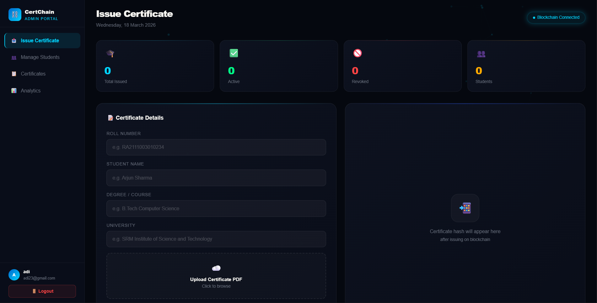
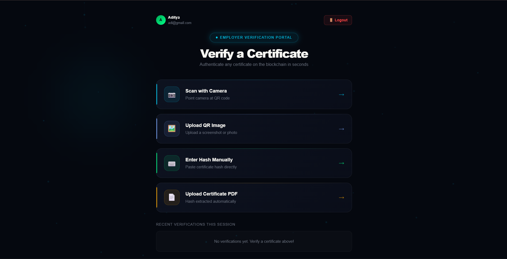
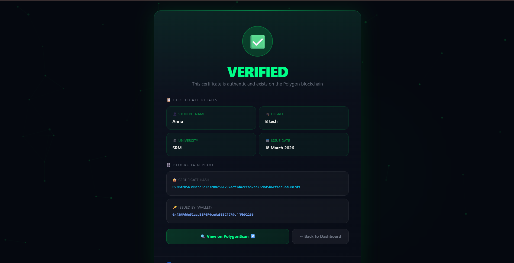

# ⛓️ CertifyPro — Blockchain Certificate Verification System


> A decentralized certificate verification system built on Polygon blockchain. Universities can issue tamper-proof certificates, students can view and share them, and employers can instantly verify authenticity.

---

## 📸 Screenshots

### Login Page


### Admin Dashboard


### Manage Students


### Student Dashboard


### Employer Verification


### Verify Certificate


### Verified Certificate


### Fake Certificate Detection


---
## 🛠️ Tech Stack

| Layer | Technology |
|-------|-----------|
| Frontend | React + Vite |
| Backend | Node.js + Express |
| Database | MongoDB Atlas |
| Blockchain | Solidity + Hardhat |
| Network | Polygon Amoy Testnet |
| Auth | JWT |

---

## ✨ Features

- 🏛️ **Admin** — Issue blockchain certificates to students
- 🎓 **Student** — View, download and share certificates via QR code
- 🏢 **Employer** — Verify certificates via hash, QR code or PDF upload
- 🔒 **Tamper-proof** — All certificates stored on Polygon blockchain
- 📱 **QR Code** — Each certificate has a unique scannable QR code

---

## ⚙️ Local Setup

### Prerequisites
- Node.js v18+
- MongoDB (local or Atlas)
- MetaMask browser extension

### 1. Clone the repo
```bash
git clone https://github.com/Anand-Aditya-23/CertifyPro.git
cd CertifyPro
```

### 2. Install dependencies
```bash
cd backend && npm install
cd ../frontend && npm install
cd ../smart-contract && npm install
```

### 3. Setup environment variables
Create `backend/.env`:
```
PORT=3001
PRIVATE_KEY=your_wallet_private_key
CONTRACT_ADDRESS=your_contract_address
POLYGON_RPC=http://127.0.0.1:8545
MONGODB_URI=your_mongodb_uri
JWT_SECRET=your_jwt_secret
```

### 4. Start the project

**Terminal 1 — Hardhat blockchain:**
```bash
cd smart-contract
npx hardhat node
```

**Terminal 2 — Deploy contract:**
```bash
cd smart-contract
npx hardhat run scripts/deploy.js --network localhost
```

**Terminal 3 — Backend:**
```bash
cd backend
npm run dev
```

**Terminal 4 — Frontend:**
```bash
cd frontend
npm run dev
```

### 5. Open browser
```
http://localhost:5173
```

---

## 👥 User Roles

### 🏛️ Admin
1. Register as Admin
2. Create student accounts with roll numbers
3. Issue certificates on blockchain

### 🎓 Student
1. Login with roll number
2. View blockchain-verified certificates
3. Download as PDF or share via QR code

### 🏢 Employer
1. Register as Employer
2. Verify certificates via PDF upload, hash or QR code

---

## 📁 Project Structure
```
CertifyPro/
├── frontend/          # React + Vite frontend
├── backend/           # Node.js + Express API
└── smart-contract/    # Solidity smart contract
```

---
## 📄 License

Copyright © 2026 Aditya Anand. All Rights Reserved.
This project is not open source. No part of this project may be copied, modified, or distributed without permission.

---

<p align="center">Made by Aditya Anand</p>