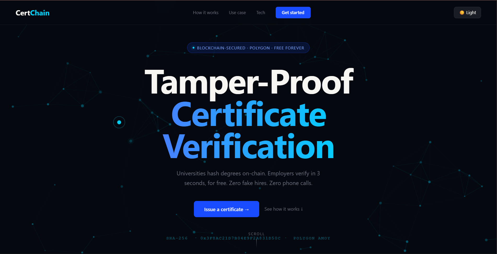
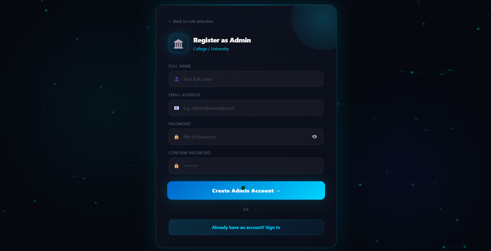
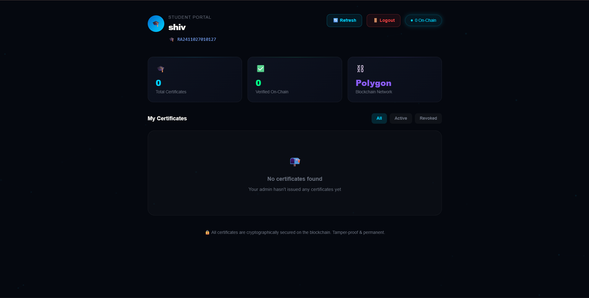
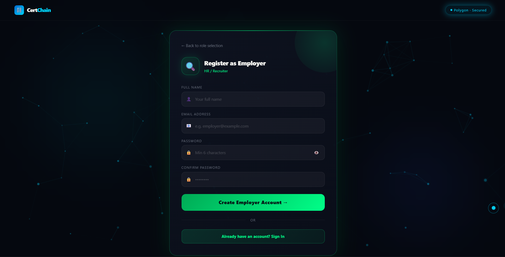

# ⛓️ CertChain — Blockchain Certificate Verification System



> A decentralized certificate verification system built on Polygon blockchain. Universities can issue tamper-proof certificates, students can view and share them, and employers can instantly verify authenticity.

---

## 🚀 Live Demo
- 🌐 Frontend: [Coming Soon]
- 🔗 Smart Contract: [Polygon Amoy Testnet](https://amoy.polygonscan.com/address/0xCf72aAf8c72FAF40A8B54aFCc54E411962eeE723)

---

## 📸 Screenshots

### Landing Page


### Admin Dashboard


### Student Dashboard


### Employer Verification


---

## 🛠️ Tech Stack

| Layer | Technology |
|-------|-----------|
| Frontend | React + Vite |
| Backend | Node.js + Express |
| Database | MongoDB Atlas |
| Blockchain | Solidity + Hardhat |
| Network | Polygon Amoy Testnet |
| Auth | JWT |

---

## ✨ Features

- 🏛️ **Admin** — Issue blockchain certificates to students
- 🎓 **Student** — View, download and share certificates via QR code
- 🏢 **Employer** — Verify certificates via hash, QR code or PDF upload
- 🔒 **Tamper-proof** — All certificates stored on Polygon blockchain
- 📱 **QR Code** — Each certificate has a unique scannable QR code

---

## ⚙️ Local Setup

### Prerequisites
- Node.js v18+
- MongoDB (local or Atlas)
- MetaMask browser extension

### 1. Clone the repo
```bash
git clone https://github.com/Anand-Aditya-23/CertChain.git
cd CertChain
```

### 2. Install dependencies
```bash
# Backend
cd backend
npm install

# Frontend
cd ../frontend
npm install

# Smart Contract
cd ../smart-contract
npm install
```

### 3. Setup environment variables
Create `backend/.env`:
```
PORT=3001
PRIVATE_KEY=your_wallet_private_key
CONTRACT_ADDRESS=your_contract_address
POLYGON_RPC=http://127.0.0.1:8545
MONGODB_URI=your_mongodb_uri
JWT_SECRET=your_jwt_secret
```

### 4. Start the project

**Terminal 1 — Start Hardhat blockchain:**
```bash
cd smart-contract
npx hardhat node
```

**Terminal 2 — Deploy smart contract:**
```bash
cd smart-contract
npx hardhat run scripts/deploy.js --network localhost
```

**Terminal 3 — Start backend:**
```bash
cd backend
npm run dev
```

**Terminal 4 — Start frontend:**
```bash
cd frontend
npm run dev
```

### 5. Open browser
```
http://localhost:5173
```

---

## 👥 User Roles

### 🏛️ Admin (University)
1. Register as Admin
2. Create student accounts with roll numbers
3. Issue certificates on blockchain
4. View all issued certificates

### 🎓 Student
1. Login with roll number
2. View blockchain-verified certificates
3. Download certificate as PDF
4. Share via QR code

### 🏢 Employer
1. Register as Employer
2. Verify certificates via:
   - PDF upload
   - Certificate hash
   - QR code scan

---

## 📁 Project Structure
```
CertChain/
├── frontend/          # React + Vite frontend
│   └── src/
│       └── pages/     # Dashboard pages
├── backend/           # Node.js + Express API
│   ├── models/        # MongoDB models
│   └── index.js       # Main server file
└── smart-contract/    # Solidity smart contract
    ├── contracts/     # CertChain.sol
    └── scripts/       # Deploy scripts
```

---

## 🔗 Smart Contract

- **Network:** Polygon Amoy Testnet
- **Address:** `0xCf72aAf8c72FAF40A8B54aFCc54E411962eeE723`
- **Explorer:** [View on Polygonscan](https://amoy.polygonscan.com/address/0xCf72aAf8c72FAF40A8B54aFCc54E411962eeE723)

---

## 🤝 Contributing

Pull requests are welcome! For major changes, please open an issue first.

---

## 📄 License

MIT License — feel free to use this project!

---

<p align="center">Made with ❤️ by Aditya Anand</p>
```

---

**To add screenshots:**

1. Create a folder `C:\Users\admin\Desktop\CertChain\screenshots`
2. Take screenshots of your app (press `Win + Shift + S`)
3. Save them as:
   - `screenshots/banner.png`
   - `screenshots/landing.png`
   - `screenshots/admin.png`
   - `screenshots/student.png`
   - `screenshots/employer.png`
4. Then push to GitHub:
```
cd C:\Users\admin\Desktop\CertChain
git add .
git commit -m "Add README with screenshots"
git push origin main